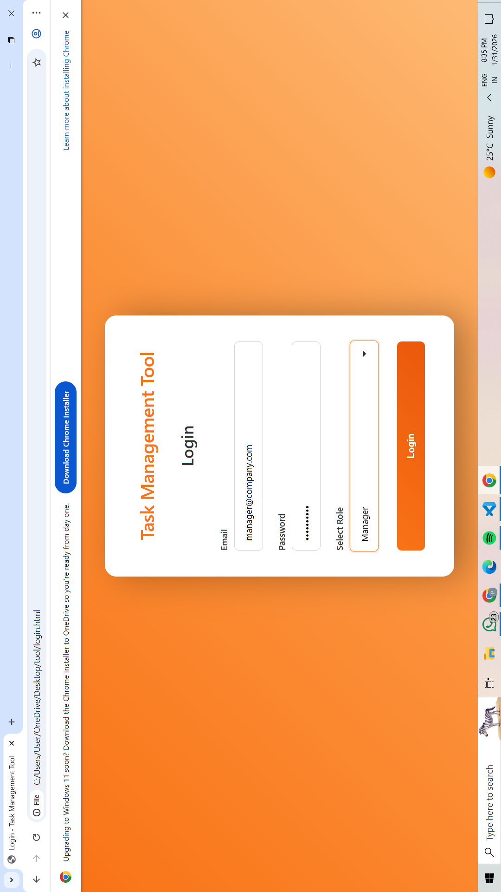
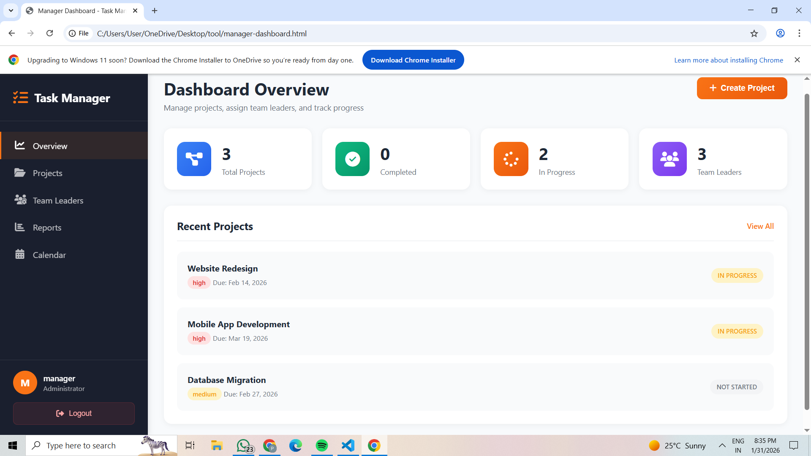
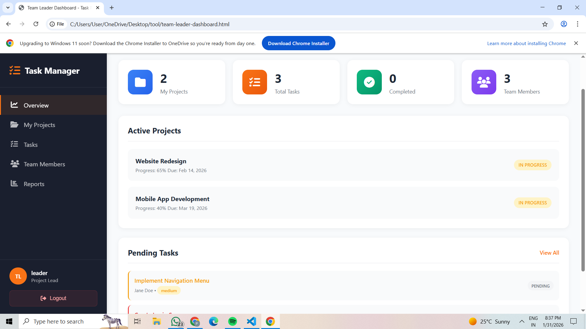
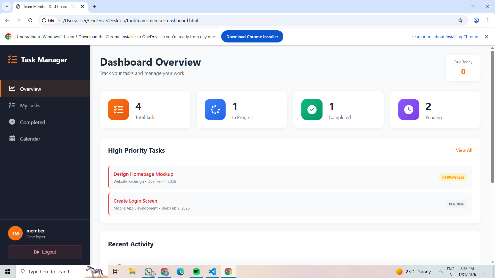

# 🎯 Task Management System

> A role-based task management system with separate dashboards for Manager, Team Leader, and Team Member.

---

## 📸 Dashboard Screenshots

### Login Page


### Manager Dashboard

*Overview with statistics, project management, and analytics*

### Team Leader Dashboard

*Kanban board for task management and team tracking*

### Team Member Dashboard

*Task list with status updates and calendar view*

---

## 📁 Files Included

```
📦 Task Management System
├── index.html                    # Login page
├── style.css                     # Login styles
├── script.js                     # Login logic
├── manager.html                  # Manager dashboard
├── manager-style.css
├── manager-script.js
├── team-leader.html              # Team Leader dashboard
├── team-leader-style.css
├── team-leader-script.js
├── team-member.html              # Team Member dashboard
├── team-member-style.css
└── team-member-script.js
```

---

## 🚀 Quick Start

### 1. Download Files
Download all 12 files to one folder

### 2. Open Application
Double-click **index.html**

### 3. Login
Use demo credentials below

---

## 🔑 Login Credentials

| Role | Email | Password | Dashboard |
|------|-------|----------|-----------|
| **👔 Manager** | manager@company.com | manager123 | Full project management |
| **👩‍💻 Team Leader** | leader@company.com | leader123 | Task & team management |
| **👨‍💻 Team Member** | member@company.com | member123 | Task execution |

> **Tip:** Click the credential boxes on login page to auto-fill!

---

## ✨ Features

### 👔 Manager Dashboard
- ✅ Create and manage projects
- ✅ Assign team leaders
- ✅ Set priorities and deadlines
- ✅ Track overall progress
- ✅ Approve/reject requests
- ✅ View analytics and reports

### 👩‍💻 Team Leader Dashboard
- ✅ View assigned projects
- ✅ Create and assign tasks
- ✅ Kanban board (Pending → In Progress → Review → Completed)
- ✅ Review submitted work
- ✅ Track team performance
- ✅ Submit reports to manager

### 👨‍💻 Team Member Dashboard
- ✅ View assigned tasks
- ✅ Update task status
- ✅ Submit work for review
- ✅ Add comments
- ✅ Calendar view for deadlines
- ✅ View completed tasks

---

## 💻 System Requirements

- **Browser:** Chrome, Firefox, Safari, Edge (latest version)
- **Internet:** Required for Font Awesome icons
- **Storage:** ~150KB
- **Server:** Not required (runs in browser)

---

## 🎨 Color Scheme

**Orange Gradient Theme**
- Primary: #f97316
- Secondary: #fb923c
- Background: Orange gradient
- Clean white cards

---

## 📖 How to Use

### Step 1: Login
1. Open `index.html`
2. Enter email and password
3. Select your role
4. Click "Login"

### Step 2: Navigate Dashboard
- Use sidebar to switch sections
- Each role has custom features
- Click logout to return to login

### Step 3: Perform Actions
- **Manager:** Create projects, assign leaders
- **Team Leader:** Create tasks, assign members
- **Team Member:** Update task status, complete work

---

## 🔄 Workflow

```
Manager creates project
    ↓
Assigns to Team Leader
    ↓
Team Leader creates tasks
    ↓
Assigns to Team Members
    ↓
Team Members complete work
    ↓
Submit for review
    ↓
Team Leader approves
    ↓
Manager monitors progress
```

---

## 🛠️ Technologies

- HTML5
- CSS3
- JavaScript (ES6+)
- Font Awesome 6.4.0
- SessionStorage

---

## 📱 Responsive Design

✅ Desktop (1920px)  
✅ Laptop (1366px)  
✅ Tablet (768px)  
✅ Mobile (375px)

---

## 🔒 Security Note

⚠️ **This is a front-end demo**
- No backend server
- No database
- Data resets on refresh
- For demonstration purposes only

For production use, add:
- Backend (Node.js/PHP/Python)
- Database (MySQL/MongoDB)
- Password encryption
- HTTPS/SSL

---

## 🐛 Troubleshooting

### Login not working?
- Check credentials are exact (case-sensitive)
- Ensure correct role selected
- Clear browser cache

### Dashboard not loading?
- Verify all files in same folder
- Check file names are exact
- Open browser console (F12) for errors

### Styles missing?
- Check internet connection (Font Awesome)
- Hard refresh (Ctrl+F5)
- Verify CSS files present

---


## 📞 Support

**Having issues?**
1. Read troubleshooting section
2. Check browser console (F12)
3. Verify all files are present
4. Test with demo credentials

---


---


